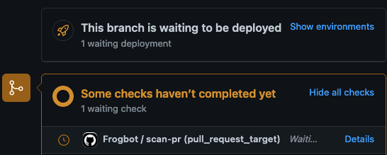
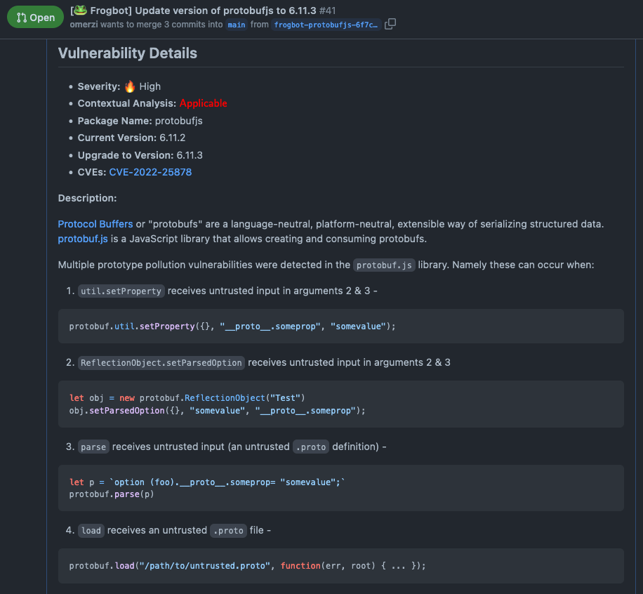
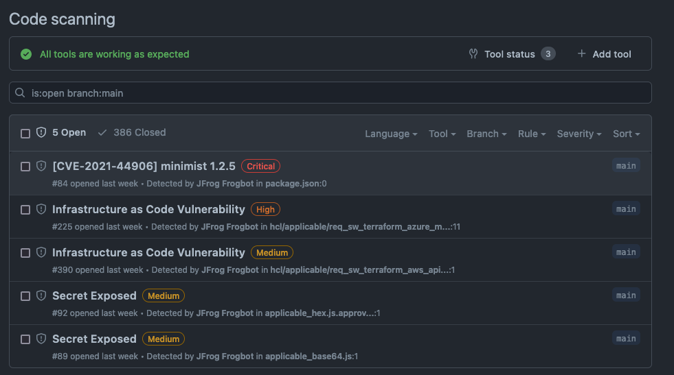

<div align="center">

# Frogbot

[](#readme)

[](https://github.com/jfrog/frogbot/actions/workflows/test.yml) [](https://github.com/jfrog/frogbot/actions/workflows/action-test.yml)
[](https://goreportcard.com/report/github.com/jfrog/frogbot)

</div>

## Table of contents

- [What is Frogbot?](#what-is-frogbot)
- [Scan pull requests when they are opened](#scan-pull-requests-when-they-are-opened)
- [Scanning repositories and fixing issues](#scanning-repositories-and-fixing-issues)
- [Installing Frogbot](#installing-frogbot)
- [Reporting issues](#reporting-issues)
- [Contributions](#contributions)

<div id="what-is-frogbot"></div>

## 🤖 What is Frogbot?

Frogbot is a Git bot that scans your pull requests and repositories for security vulnerabilities. You can scan pull requests when they are opened, and Git repositories following new commits.

<a href="https://www.youtube.com/watch?v=aw-AAxtAVwY"></a>

## Scan pull requests when they are opened

### General

Frogbot uses [JFrog Xray](https://jfrog.com/xray/) (version 3.29.0 and above is required) to scan your pull requests. It adds the scan results as a comment on the pull request. If no new vulnerabilities are found, Frogbot will also add a comment, confirming this.

Supported platforms:

- Azure Repos
- Bitbucket Server
- GitHub
- GitLab

Supported package management tools:

- Go
- Gradle
- Maven
- .NET
- npm
- NuGet
- Pip
- Pipenv
- Poetry
- Yarn 2

### 🕵️‍♀️ How does Pull Request scanning work?

<details>
  <summary>Azure Repos</summary>

After you create a new pull request, Frogbot will automatically scan it.

> **_NOTE:_** The scan output will include only new vulnerabilities added by the pull request.
> Vulnerabilities that aren't new, and existed in the code before the pull request was created, will not be included in
> the
> report. In order to include all the vulnerabilities in the report, including older ones that weren't added by this
> PR, use the includeAllVulnerabilities parameter in the frogbot-config.yml file.

The Frogbot Azure Repos scan workflow is:

1. The developer opens a pull request.
2. Frogbot scans the pull request and adds a comment with the scan results.
3. Frogbot can be triggered again following new commits, by adding a comment with the `rescan` text.

</details>

<details>
  <summary>Bitbucket Server</summary>

After you create a new pull request, Frogbot will automatically scan it.

> **_NOTE:_** The scan output will include only new vulnerabilities added by the pull request.
> Vulnerabilities that aren't new, and existed in the code before the pull request was created, will not be included in
> the
> report. In order to include all of the vulnerabilities in the report, including older ones that weren't added by this
> PR, use the includeAllVulnerabilities parameter in the frogbot-config.yml file.

The Frogbot scan on Bitbucket Server workflow:

1. The developer opens a pull request.
2. Frogbot scans the pull request and adds a comment with the scan results.
3. Frogbot can be triggered again following new commits, by adding a comment with the `rescan` text.

</details>

<details>
  <summary>GitHub</summary>

After you create a new pull request, the maintainer of the Git repository can trigger Frogbot to scan the pull request from the pull request UI.

> **_NOTE:_** The scan output will include only new vulnerabilities added by the pull request.
> Vulnerabilities that aren't new, and existed in the code before the pull request was created, will not be included in
> the
> report. In order to include all of the vulnerabilities in the report, including older ones that weren't added by this
> PR, use the includeAllVulnerabilities parameter in the frogbot-config.yml file.

The Frogbot GitHub scan workflow is:

1. The developer opens a pull request.
2. The Frogbot workflow automatically gets triggered and a [GitHub environment](https://docs.github.com/en/actions/deployment/targeting-different-environments/using-environments-for-deployment#creating-an-environment) named `frogbot` becomes pending for the maintainer's approval.

[](#running-frogbot-on-github)

3. The maintainer of the repository reviews the pull request and approves the scan: [](#running-frogbot-on-github)
4. Frogbot can be triggered again following new commits, by repeating steps 2 and 3.

</details>

<details>
  <summary>GitLab</summary>

After you create a new merge request, the maintainer of the Git repository can trigger Frogbot to scan the merge request from the merge request UI.

> **_NOTE:_** The scan output will include only new vulnerabilities added by the merge request.
> Vulnerabilities that aren't new, and existed in the code before the merge request was created, will not be included in
> the
> report. In order to include all of the vulnerabilities in the report, including older ones that weren't added by this
> merge request, use the includeAllVulnerabilities parameter in the frogbot-config.yml file.

The Frogbot GitLab flow is as follows:

1. The developer opens a merge request.
2. The maintainer of the repository reviews the merge request and approves the scan by triggering the manual _frogbot-scan_ job.
3. Frogbot is then triggered by the job, it scans the merge request, and adds a comment with the scan results.
4. Frogbot can be triggered again following new commits, by triggering the _frogbot-scan_ job again.
   [GitLab CI Run Button](./images/gitlab-run-button.png)

</details>

### 👮 Security note for pull requests scanning

When installing Frogbot using JFrog Pipelines, Jenkins and Azure DevOps, Frogbot will not wait for a maintainer approval before scanning newly opened pull requests. Using Frogbot with these platforms however isn't recommended for open source projects.
When installing Frogbot using GitHub Actions and GitLab however, Frogbot will initiate the scan only after it is approved by a maintainer of the project, and therefore it is safe to be used for open source projects.

### Scan results

Frogbot adds the scan results to the pull request in the following format:

#### 👍 No issues

If no new vulnerabilities are found, Frogbot automatically adds the following comment to the pull request:

[](#-no-issues)

#### 👎 Issues were found

If new vulnerabilities are found, Frogbot adds them as a comment on the pull request. For example:

[](#-issues-were-found)

|                                            SEVERITY                                             | IMPACTED PACKAGE                         | VERSION | FIXED VERSIONS | COMPONENT                                | COMPONENT VERSION | CVE            |
| :---------------------------------------------------------------------------------------------: | ---------------------------------------- | ------- | -------------- | ---------------------------------------- | :---------------: | -------------- |
|    High   | github.com/nats-io/nats-streaming-server | v0.21.0 | [0.24.1]       | github.com/nats-io/nats-streaming-server |      v0.21.0      | CVE-2022-24450 |
|    High   | github.com/mholt/archiver/v3             | v3.5.1  |                | github.com/mholt/archiver/v3             |      v3.5.1       |
|  Medium | github.com/nats-io/nats-streaming-server | v0.21.0 | [0.24.3]       | github.com/nats-io/nats-streaming-server |      v0.21.0      | CVE-2022-26652 |

## Scanning repositories and fixing issues

Frogbot scans your Git repository and automatically opens pull requests for upgrading vulnerable dependencies to a version with a fix.



For GitHub repositories, Frogbot also adds [Security Alerts](https://docs.github.com/en/code-security/code-scanning/automatically-scanning-your-code-for-vulnerabilities-and-errors/managing-code-scanning-alerts-for-your-repository) which you can view in the GitHub UI:



Frogbot uses [JFrog Xray](https://jfrog.com/xray/) for the scanning. The scanning is triggered following commits that
are pushed to the repository.

Supported package management tools:

- Go
- Maven
- npm
- Pip
- Pipenv
- Poetry
- Yarn 2

</details>

<div id="installing-frogbot"></div>

## 🖥️ Installing Frogbot

<details>
  <summary>Step 1 - Optionally set up a FREE JFrog Environment in the Cloud</summary>

Frogbot requires a JFrog environment to scan your projects. If you don't have an environment, we can set up a free environment in the cloud for you. Just run one of the following commands in your terminal to set up an environment in less than a minute.

The commands will do the following:

1. Install [JFrog CLI](https://www.jfrog.com/confluence/display/CLI/JFrog+CLI) on your machine.
2. Create a FREE JFrog environment in the cloud for you.

**For macOS and Linux, use curl**

```
curl -fL "https://getcli.jfrog.io?setup" | sh
```

**For Windows, use PowerShell**

```
powershell "Start-Process -Wait -Verb RunAs powershell '-NoProfile iwr https://releases.jfrog.io/artifactory/jfrog-cli/v2-jf/[RELEASE]/jfrog-cli-windows-amd64/jf.exe -OutFile $env:SYSTEMROOT\system32\jf.exe'" ; jf setup
```

After the setup is complete, you'll receive an email with your JFrog environment connection details, which can be stored as secrets in Git.

</details>

<details>
  <summary>Step 2 - Install Frogbot</summary>

- [Installing Frogbot on Azure Repos repositories](docs/install-azure-repos.md)
- [Installing Frogbot on Bitbucket Server repositories](docs/install-bitbucket-server.md)
- [Installing Frogbot on GitHub repositories](docs/install-github.md)
- [Installing Frogbot on GitLab repositories](docs/install-gitlab.md)

</details>

<div id="reporting-issues"></div>

## 🔥 Reporting issues

Please help us improve Frogbot by [reporting issues](https://github.com/jfrog/frogbot/issues/new/choose) you encounter.

<div id="contributions"></div>

## 💻 Contributions

We welcome pull requests from the community. To help us improve this project, please read our [Contribution](./CONTRIBUTING.md#-guidelines) guide.
