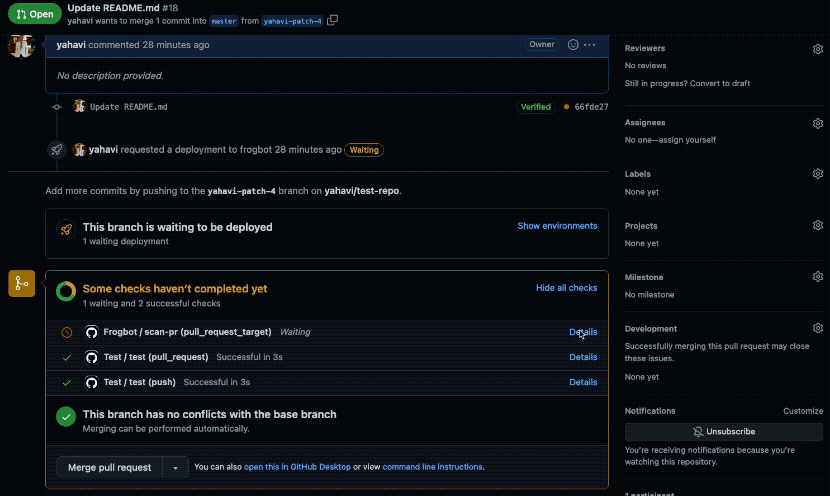
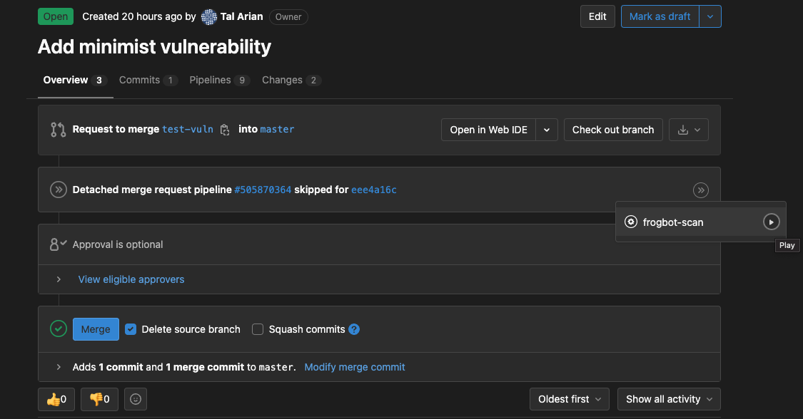
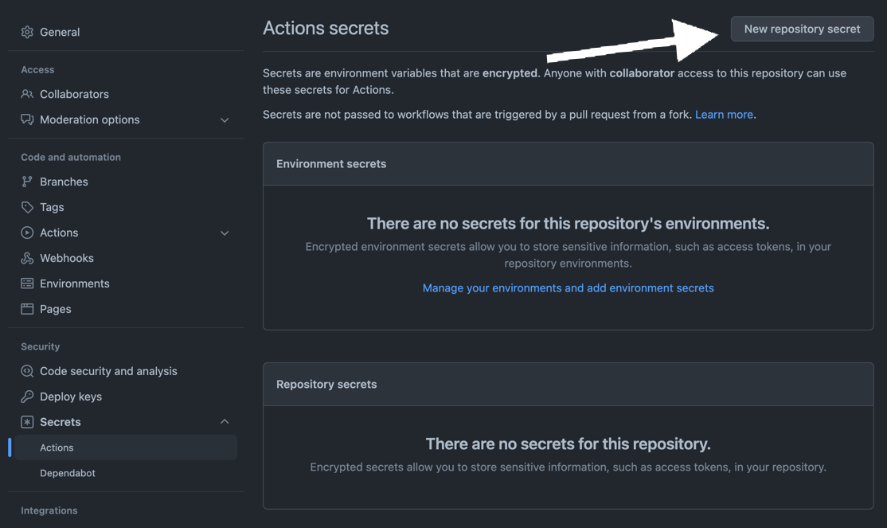

<div align="center">
   
# Frogbot

[](#readme)

[](https://github.com/jfrog/frogbot/actions/workflows/test.yml) [](https://github.com/jfrog/frogbot/actions/workflows/action-test.yml)
[](https://goreportcard.com/report/github.com/jfrog/frogbot)

</div>

## Table of contents
- [What is Frogbot?](#what-is-frogbot)
- [Scanning pull requests after they are opened](#scanning-pull-requests-after-they-are-opened)
- [Scanning repositories after pull requests are merged](#scanning-repositories-after-pull-requests-are-merged)
- [Installing and using Frogbot](#installing-and-using-frogbot)
- [Contributions](#contributions)

<div id="what-is-frogbot"></div>

## 🤖 What is Frogbot?
Frogbot is a Git bot that scans your pull requests after they are opened and also scans your Git repositories right after pull requests are merged.

## Scanning pull requests after they are opened
### General 
Frogbot uses [JFrog Xray](https://jfrog.com/xray/) (version 3.29.0 or above is required) to scan your pull requests. It adds the scan results as a comment on the pull request. If no new vulnerabilities are found, Frogbot will also add a comment, confirming this.
For pull requests scanning, please note that **GitHub**, **GitLab** and **Bitbucket Server** are supported.
Projects that use one of the following tools to download their dependencies are currently supported.

- Npm
- Yarn
- Maven
- Gradle
- Go
- Pip
- Pipenv
- Nuget
- Dotnet

### 🕵️‍♀️ How does pull requests scanning work?
#### GitHub
For security reasons, Frogbot is not triggered automatically.
After you create a new pull request, the maintainer of the git repository can trigger Frogbot to scan the pull request from the pull request UI. The scan output will include only new vulnerabilities added by the pull request.
Vulnerabilities that aren't new, and existed in the code prior to the pull request creation, will not be included in the
report. In order to include all of the vulnerabilities in the report, including older ones that weren't added by this
PR, use the JF_INCLUDE_ALL_VULNERABILITIES environment variable.

1. A developer opens a pull request.
2. The Frogbot workflow automatically gets triggered and a [GitHub environment](https://docs.github.com/en/actions/deployment/targeting-different-environments/using-environments-for-deployment#creating-an-environment) named _frogbot_ is pending for the maintainer's approval: 

[](#running-frogbot-on-github)

3. A Maintainer reviews the pull request and approves the scan: [](#running-frogbot-on-github)
4. Frogbot can be triggered again following new commits, by repeating steps 2 and 3.

#### GitLab

For security reasons, Frogbot is not triggered automatically.
After you create a new pull request, the maintainer of the git repository can trigger Frogbot to scan the pull request
from the pull request UI. The scan output will include only new vulnerabilities added by the pull request.
Vulnerabilities that aren't new, and existed in the code prior to the pull request creation, will not be included in the
report. In order to include all of the vulnerabilities in the report, including older ones that weren't added by this
PR, use the JF_INCLUDE_ALL_VULNERABILITIES environment variable.

1. A developer opens a merge request.
2. A maintainer of the repository triggers the manual **frogbot-scan** job.
3. Frogbot is triggered by the job, scans the merge request, and adds a comment with the scan results.
4. Frogbot can be triggered again following new commits, by triggering the **frogbot-scan** job again.
   []

#### Bitbucket Server

After you create a new pull request, Frogbot will automatically scan it. The scan output will include only new
vulnerabilities added by the pull request. Vulnerabilities that aren't new, and existed in the code prior to the pull
request creation, will not be included in the report. In order to include all of the vulnerabilities in the report,
including older ones that weren't added by this PR, use the JF_INCLUDE_ALL_VULNERABILITIES environment variable.

1. A developer opens a pull request.
2. Frogbot is triggered and scans the pull request, and adds a comment with the scan results.
3. Frogbot can be triggered again following new commits, by adding a comment with the `rescan` text.

#### Pull request comments
##### 👍 No issues
If no new vulnerabilities are found, Frogbot automatically adds the following comment to the pull request:

[](#-no-issues)

##### 👎 Issues were found
If new vulnerabilities are found, Frogbot adds them as a comment on the pull request. For example:

[](#-issues-were-found)

|                                            SEVERITY                                             | IMPACTED PACKAGE                         | VERSION | FIXED VERSIONS | COMPONENT                                | COMPONENT VERSION | CVE            |
| :---------------------------------------------------------------------------------------------: | ---------------------------------------- | ------- | -------------- | ---------------------------------------- | :---------------: | -------------- |
|    High   | github.com/nats-io/nats-streaming-server | v0.21.0 | [0.24.1]       | github.com/nats-io/nats-streaming-server |      v0.21.0      | CVE-2022-24450 |
|    High   | github.com/mholt/archiver/v3             | v3.5.1  |                | github.com/mholt/archiver/v3             |      v3.5.1       |
|  Medium | github.com/nats-io/nats-streaming-server | v0.21.0 | [0.24.3]       | github.com/nats-io/nats-streaming-server |      v0.21.0      | CVE-2022-26652 |

## Scanning repositories after pull requests are merged
Frogbot scans your Git repository and automatically opens pull requests for upgrading vulnerable dependencies to a version with a fix. 

For Gihub repositories, Frogbot also adds [Security Alerts](https://docs.github.com/en/code-security/code-scanning/automatically-scanning-your-code-for-vulnerabilities-and-errors/managing-code-scanning-alerts-for-your-repository) which can be viewed through the GitHub UI.

Frogbot uses [JFrog Xray](https://jfrog.com/xray/) for the scanning. The scanning is triggered following commits that
are pushed to the repository. For pull requests opening, please note that GitHub and GitLab are currently supported and
Bitbucket will be supported soon. Projects that use one of the following tools to download their dependencies are
currently supported.

- Npm
- Yarn
- Maven
- Go
- Pip
- Pipenv

<div id="installing-and-using-frogbot"></div>

## 🖥️ Installing and using Frogbot
<details>
  <summary>Setting up a FREE JFrog Environment in the cloud</summary>

Frogbot requires a JFrog environment to scan your projects with. If you don't have an environment, we can set up one in the cloud for you doe free.
Just run one of the following commands in your terminal, to set up an environment in less than a minute. 

The commands will do the following:

1. Install [JFrog CLI](https://www.jfrog.com/confluence/display/CLI/JFrog+CLI) on your machine.
2. Create a FREE JFrog environment in the cloud for you.

After the setup is complete, you'll receive an email with your JFrog environment connection details, which you can then store as secrets in Git.

**On macOS and Linux using cUrl**

```
curl -fL https://getcli.jfrog.io?setup | sh
```

**On Windows using PowerShell**

```
powershell "Start-Process -Wait -Verb RunAs powershell '-NoProfile iwr https://releases.jfrog.io/artifactory/jfrog-cli/v2-jf/[RELEASE]/jfrog-cli-windows-amd64/jf.exe -OutFile $env:SYSTEMROOT\system32\jf.exe'" ; jf setup
```
</details>

<details>
  <summary>Setting up Frogbot on GitHub repositories</summary>

Frogbot is installed on GitHub repositories using GitHub Actions. 
Here's how you install it:

1. Make sure you have the connection details of your JFrog environment.
2. At your GitHub repository settings, save the JFrog connection details as repository secrets with the following names - **JF_URL**, **JF_USER**, and **JF_PASSWORD** (You can also use **JF_XRAY_URL** and **JF_ARTIFACTORY_URL** instead of  **JF_URL**, and **JF_ACCESS_TOKEN** instead of **JF_USER** and **JF_PASSWORD**)
   
   

3. Make sure GitHub Actions has permissions to create pull requests.

   

4. Create a new "frogbot" [GitHub environment](https://docs.github.com/en/actions/deployment/targeting-different-environments/using-environments-for-deployment#creating-an-environment) and add people or public teams as reviewers. The chosen reviewers are authorized to trigger Frogbot scan on pull requests.

   

5. Use these [GitHub Actions templates](templates/github-actions/README.md#frogbot-gitHub-actions-templates) to add Frogbot workflows to your project.
6. Push the workflow files to the `.github/workflows` directory in the root of your GitHub repository.

</details>

<details>
  <summary>Setting up Frogbot on GitLab repositories</summary>

Frogbot is installed on GitLab repositories using GitLab CI.
Here's how you install it:

1. Make sure you have the connection details of your JFrog environment.
2. Save the JFrog connection details as secrets in GitLab with the following names: **JF_URL**, **JF_USER** and **JF_PASSWORD** (You can also use **JF_XRAY_URL** and **JF_ARTIFACTORY_URL** instead of  **JF_URL** and **JF_ACCESS_TOKEN** instead of **JF_USER** and **JF_PASSWORD**).
3. Add a job named `frogbot-scan` to your `.gitlab-ci.yml` file in your GitLab repository using the below structure.

**Important Guidelines**

- For npm, pip, pipenv, nuget or dotnet: Make sure to set the command in a way that it downloads your project dependencies as the value of the **JF_INSTALL_DEPS_CMD** variable. For example, `npm i` or `nuget restore`
- Make sure that either **JF_USER** and **JF_PASSWORD** or **JF_ACCESS_TOKEN** are set, but not both.

```yml
frogbot-scan:
  rules:
    - if: $CI_PIPELINE_SOURCE == 'merge_request_event'
      when: manual
      variables:
        FROGBOT_CMD: "scan-pull-request"
        JF_GIT_BASE_BRANCH: $CI_MERGE_REQUEST_TARGET_BRANCH_NAME
      # Creating fix pull requests will be triggered by any push to the default branch.
      # You can change it to any other branch you want, for example:
      # if: $CI_COMMIT_BRANCH == "dev"
    - if: $CI_COMMIT_BRANCH == $CI_DEFAULT_BRANCH
      variables:
        FROGBOT_CMD: "create-fix-pull-requests"
        JF_GIT_BASE_BRANCH: $CI_COMMIT_BRANCH
  variables:
    # [Mandatory only for projects which use npm, pip, pipenv, nuget and dotnet to download their dependencies]
    # The command that installs the project dependencies (e.g "npm i", "nuget restore" or "dotnet restore")
    JF_INSTALL_DEPS_CMD: ""

    # [Mandatory]
    # JFrog platform URL (This functionality requires version 3.29.0 or above of Xray)
    JF_URL: $JF_URL

    # [Mandatory if JF_ACCESS_TOKEN is not provided]
    # JFrog user and password with 'read' permissions for Xray
    JF_USER: $JF_USER
    JF_PASSWORD: $JF_PASSWORD

    # [Mandatory]
    # GitLab accesses token with the following permissions scopes: api, read_api, read_user, read_repository
    JF_GIT_TOKEN: $USER_TOKEN

    # Predefined GitLab variables. There's no need to set them.
    JF_GIT_PROVIDER: gitlab
    JF_GIT_OWNER: $CI_PROJECT_NAMESPACE
    JF_GIT_REPO: $CI_PROJECT_NAME
    JF_GIT_PULL_REQUEST_ID: $CI_MERGE_REQUEST_IID

    # Uncomment the below options if you'd like to use them.

    # [Optional, default: https://gitlab.com]
    # API endpoint to GitLab
    # JF_GIT_API_ENDPOINT: https://gitlab.example.com

    # [Mandatory if JF_USER and JF_PASSWORD are not provided]
    # JFrog access token with 'read' permissions for Xray
    # JF_ACCESS_TOKEN: $JF_ACCESS_TOKEN

    # [Optional, default: "."]
    # Relative path to the project in the git repository
    # JF_WORKING_DIR: path/to/project/dir

    # [Optional]
    # Xray Watches. Learn more about them here: https://www.jfrog.com/confluence/display/JFROG/Configuring+Xray+Watches
    # JF_WATCHES: <watch-1>,<watch-2>...<watch-n>

    # [Optional]
    # JFrog project. Learn more about it here: https://www.jfrog.com/confluence/display/JFROG/Projects
    # JF_PROJECT: <project-key>

    # [Optional, default: "FALSE"]
    # Displays all existing vulnerabilities, including the ones that were added by the pull request.
    # JF_INCLUDE_ALL_VULNERABILITIES: "TRUE"
  script:
    # For Linux / MacOS runner:
    - curl -fLg "https://releases.jfrog.io/artifactory/frogbot/v2/[RELEASE]/getFrogbot.sh" | sh
    - ./frogbot ${FROGBOT_CMD}

    # For Windows runner:
    # iwr https://releases.jfrog.io/artifactory/frogbot/v2/[RELEASE]/frogbot-windows-amd64/frogbot.exe -OutFile .\frogbot.exe
    # .\frogbot.exe ${FROGBOT_CMD}
```
</details>

<details>
  <summary>Setting up Frogbot on Bitbucket Server repositories</summary>
    
Frogbot is installed on Bitbucket Server repositories using JFrog Pipelines or Jenkins.
#### Using JFrog Pipelines
Here's how you install it using JFrog Pipelines:

1. Make sure you have the connection details of your JFrog environment.
2. Save the JFrog connection details as a [JFrog Platform Access Token Integration](https://www.jfrog.com/confluence/display/JFROG/JFrog+Platform+Access+Token+Integration) named **jfrogPlatform**.
3. Save your Bitbucket access token as a [Generic Integration](https://www.jfrog.com/confluence/display/JFROG/Generic+Integration) named **bitbucket** with the **token** as key and the Bitbucket access token as value.
4. Create a Pipelines job with the below pipelines.yml content.
5. In the pipelines.yml, make sure to set values for all the mandatory variables.
6. In the pipelines.yml, if you're using a Windows agent, modify the code inside the onExecute sections as described on the yaml comments.

**Important Guidelines**

- For npm, pip, pipenv, nuget or dotnet: Make sure to set inside the pipelines.yml the command in a way that it downloads your project dependencies as the value of the **JF_INSTALL_DEPS_CMD** variable. For example, `npm i` or `nuget restore`
- Make sure that all necessary build tool that are used to build the scanned project are installed on the Pipelines agent.

```yml
resources:
  - name: cron_trigger
    type: CronTrigger
    configuration:
      interval: '*/5 * * * *'     # Every 5 minutes

 
pipelines:
  - name: Frogbot
    steps:
      - name: Frogbot_Scan
        type: Bash # For Windows runner: PowerShell
        configuration:
          integrations:
            - name: jfrogPlatform
            - name: bitbucket
          inputResources:
            - name: cron_trigger
          environmentVariables:
            # [Mandatory only for projects which use npm, pip, pipenv, nuget and dotnet to download their dependencies]
            # The command that installs the project dependencies (e.g "npm i", "nuget restore" or "dotnet restore")
            JF_INSTALL_DEPS_CMD: ""

            # [Mandatory]
            # JFrog platform URL
            JF_URL: $int_jfrogPlatform_url

            # [Mandatory if JF_USER and JF_PASSWORD are not provided]
            # JFrog access token with 'read' permissions for Xray
            JF_ACCESS_TOKEN: $int_jfrogPlatform_accessToken

            # [Mandatory]
            # Bitbucket accesses token with the following permissions 
            JF_GIT_TOKEN: $int_bitbucket_token
            JF_GIT_PROVIDER: "bitbucketServer"

            # [Mandatory]
            # API endpoint to Bitbucket server
            JF_GIT_API_ENDPOINT: $int_bitbucket_url

            # [Mandatory]
            # Bitbucket project namespace
            JF_GIT_OWNER: ""

            # [Mandatory]
            # Bitbucket repository name
            JF_GIT_REPO: ""

            # Uncomment the below options if you'd like to use them.

            # [Optional, default: "."]
             # Relative path to the project in the git repository
             # JF_WORKING_DIR: path/to/project/dir

             # [Optional]
             # Xray Watches. Learn more about them here: https://www.jfrog.com/confluence/display/JFROG/Configuring+Xray+Watches
             # JF_WATCHES: <watch-1>,<watch-2>...<watch-n>

             # [Optional]
             # JFrog project. Learn more about it here: https://www.jfrog.com/confluence/display/JFROG/Projects
             # JF_PROJECT: <project-key>

             # [Optional, default: "FALSE"]
             # Displays all existing vulnerabilities, including the ones that were added by the pull request.
             # JF_INCLUDE_ALL_VULNERABILITIES: "TRUE"
        execution:
           onExecute:
              - curl -fLg "https://releases.jfrog.io/artifactory/frogbot/v2/[RELEASE]/getFrogbot.sh" | sh
              - ./frogbot scan-pull-requests
              # For Windows runner:
              # - iwr https://releases.jfrog.io/artifactory/frogbot/v2/[RELEASE]/frogbot-windows-amd64/frogbot.exe -OutFile .\frogbot.exe
              # - .\frogbot.exe scan-pull-requests
```

#### Using Jenkins
Here's how you install it using Jenkins:

1. Make sure you have the connection details of your JFrog environment.
2. Save the JFrog connection details as Credentials in Jenkins with the following Credential IDs: **JF_URL**, **JF_USER** and **JF_PASSWORD** (You can also use **JF_XRAY_URL** and **JF_ARTIFACTORY_URL** instead of  **JF_URL** and **JF_ACCESS_TOKEN** instead of **JF_USER** and **JF_PASSWORD**).
3. Save your Bitbucket access token as a Credential in Jenkins with the BITBUCKET_TOKEN Credential ID.
4. Create a Pipeline job in Jenkins with the below Jenkinsfile content.
5. In the Jenkinsfile, set the values of all the mandatory variables.
6. In the Jenkinsfile, modify the code inside the `Download Frogbot` and `Scan Pull Requests` according to the Jenkins agent operating system.

**Important Guidelines**

- For npm, pip, pipenv, nuget or dotnet: Make sure to set inside the Jenkinsfile the command in a way that it downloads your project dependencies as the value of the **JF_INSTALL_DEPS_CMD** variable. For example, `npm i` or `nuget restore`
- Make sure that either **JF_USER** and **JF_PASSWORD** or **JF_ACCESS_TOKEN** are set in the Jenkinsfile, but not both.
- Make sure that all necessary build tool that are used to build the scanned project are installed on the Jenkins agent.

```groovy
// Run the job every 5 minutes 
CRON_SETTINGS = '''*/5 * * * *'''

pipeline {
    agent any

    triggers {
        cron(CRON_SETTINGS)
    }

    environment {
        // [Mandatory only for projects which use npm, pip, pipenv, nuget and dotnet to download their dependencies]
        // The command that installs the project dependencies (e.g "npm i", "nuget restore" or "dotnet restore")
        JF_INSTALL_DEPS_CMD= ""

        // [Mandatory]
        // JFrog platform URL (This functionality requires version 3.29.0 or above of Xray)
        JF_URL= credentials("JF_URL")

        // [Mandatory if JF_ACCESS_TOKEN is not provided]
        // JFrog user and password with 'read' permissions for Xray
        JF_USER= credentials("JF_USER")
        JF_PASSWORD= credentials("JF_PASSWORD")

        // [Mandatory]
        // Bitbucket accesses token with the following permissions 
        JF_GIT_TOKEN= credentials("BITBUCKET_TOKEN")
        JF_GIT_PROVIDER= "bitbucketServer"

        // [Mandatory]
        // Bitbucket project namespace
        JF_GIT_OWNER= ""

        // [Mandatory]
        // Bitbucket repository name
        JF_GIT_REPO= ""

        // [Mandatory]
        // API endpoint to Bitbucket server
        JF_GIT_API_ENDPOINT= ""

        // Uncomment the below options if you'd like to use them.

        // [Mandatory if JF_USER and JF_PASSWORD are not provided]
        // JFrog access token with 'read' permissions for Xray
        // JF_ACCESS_TOKEN= credentials("JF_ACCESS_TOKEN")

        // [Optional, default: "."]
        // Relative path to the project in the git repository
        // JF_WORKING_DIR= path/to/project/dir

        // [Optional]
        // Xray Watches. Learn more about them here: https://www.jfrog.com/confluence/display/JFROG/Configuring+Xray+Watches
        // JF_WATCHES= <watch-1>,<watch-2>...<watch-n>

        // [Optional]
        // JFrog project. Learn more about it here: https://www.jfrog.com/confluence/display/JFROG/Projects
        // JF_PROJECT= <project-key>

        // [Optional, default: "FALSE"]
        // Displays all existing vulnerabilities, including the ones that were added by the pull request.
        // JF_INCLUDE_ALL_VULNERABILITIES= "TRUE"
    }

   stages {
      stage('Download Frogbot') {
         steps {
            // For Linux / MacOS runner:
            sh """ curl -fLg "https://releases.jfrog.io/artifactory/frogbot/v2/[RELEASE]/getFrogbot.sh" | sh"""

            // For Windows runner:
            // powershell """iwr https://releases.jfrog.io/artifactory/frogbot/v2/[RELEASE]/frogbot-windows-amd64/frogbot.exe -OutFile .\frogbot.exe"""
            }
        }

        stage ('Scan Pull Requests') {
            steps {
                sh "./frogbot scan-pull-requests"

                // For Windows runner:
                // powershell """.\frogbot.exe scan-pull-requests"""
            }
        }
    }
}
```
</details>

<div id="contributions"></div>

## 💻 Contributions

We welcome pull requests from the community. To help us improve this project, please read our [Contribution](./CONTRIBUTING.md#-guidelines) guide.
