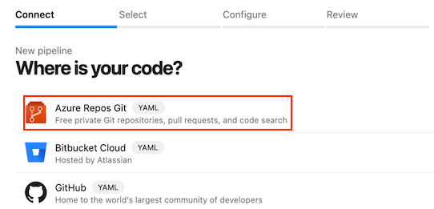
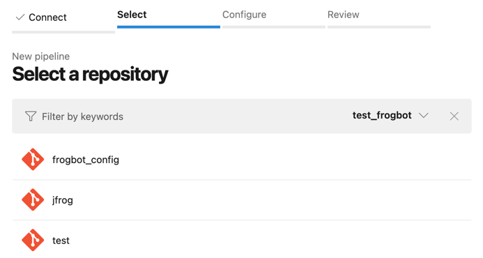

[Go back to the main documentation page](../README.md)

# Installing Frogbot on Azure Repos repositories

To install Frogbot on Azure Repos repositories, follow these steps.

1. Frogbot uses a [frogbot-config.yml](templates/.frogbot/frogbot-config.yml) file to run. [This](frogbot-config.md) article will guide you through the process of creating this file. Throughout this documentation we will reference this Git repository which includes the [frogbot-config.yml](templates/.frogbot/frogbot-config.yml) file as the **Frogbot Management Repository**.

2. Make sure you have the connection details of your JFrog environment.

3. Decide which repository branches you'd like to scan.

4. Go to your Azure Pipelines project, and add a new pipeline.

   

5. Set `Azure Repos Git` as your code source.

   

6. Select the repository you'd like Frogbot to scan.

   

7. Select `Starter Pipeline` and name it `frogbot-scan-pr`.

   

8. Use the content of the below template for the pipeline. Edit the list of branches in the template according to the branches you'd like Frogbot to scan.

    <details>
      <summary>Template for frogbot-scan-pr.yml</summary>

    ```yml
    # Select on which branches to trigger the pipeline
    trigger:
      branches:
        include:
          - master
             - dev
             - main
    
    pool:
       vmImage: ubuntu-latest
    
    jobs:
       - job:
         condition: and(succeeded(), eq(variables['Build.Reason'], 'PullRequest'))
         displayName: "Frogbot Scan Pull Request"
         steps:
            - task: CmdLine@2
              displayName: 'Download and Run Frogbot'
              env:
                 # [Mandatory]
                 # Azure Repos personal access token with Code -> Read & Write permissions
                 JF_GIT_TOKEN: $(USER_TOKEN)
    
                 # [Mandatory only for projects which use npm, yarn 2, NuGet and .NET to download their dependencies]
                 # The command that installs the project dependencies (e.g "npm i", "nuget restore" or "dotnet restore")
                 JF_INSTALL_DEPS_CMD: ""
    
                 # [Mandatory]
                 # JFrog platform URL (This functionality requires version 3.29.0 or above of Xray)
                 JF_URL: $(JF_URL)
    
                 # [Mandatory if JF_ACCESS_TOKEN is not provided]
                 # JFrog user and password with 'read' permissions for Xray
                 JF_USER: $(JF_USER)
                 JF_PASSWORD: $(JF_PASSWORD)
    
                 # [Mandatory if JF_USER and JF_PASSWORD are not provided]
                 # JFrog access token with 'read' permissions for Xray
                 # JF_ACCESS_TOKEN: $(JF_ACCESS_TOKEN)
    
                 # [Optional, default: "."]
                 # Relative path to the project in the git repository
                 # JF_WORKING_DIR: path/to/project/dir
    
                 # [Optional]
                 # Xray Watches. Learn more about them here: https://www.jfrog.com/confluence/display/JFROG/Configuring+Xray+Watches
                 # JF_WATCHES: <watch-1>,<watch-2>...<watch-n>
    
                 # [Optional]
                 # JFrog project. Learn more about it here: https://www.jfrog.com/confluence/display/JFROG/Projects
                 # JF_PROJECT: <project-key>
    
                 # [Optional, default: "FALSE"]
                 # Displays all existing vulnerabilities, including the ones that were added by the pull request.
                 # JF_INCLUDE_ALL_VULNERABILITIES: "TRUE"
    
                 # [Optional, default: "TRUE"]
                 # Fails the Frogbot task if any security issue is found.
                 # JF_FAIL: "FALSE"
    
                 # Predefined Azure Pipelines variables. There's no need to set them.
                 JF_GIT_PULL_REQUEST_ID: $(System.PullRequest.PullRequestId)
                 JF_GIT_PROJECT: $(System.TeamProject)
                 JF_GIT_REPO: $(Build.Repository.Name)
                 JF_GIT_API_ENDPOINT: $(System.CollectionUri)
                 JF_GIT_BASE_BRANCH: $(System.PullRequest.TargetBranch)
                 JF_GIT_OWNER: $(System.TeamProject)
                 JF_GIT_PROVIDER: 'azureRepos'
    
              inputs:
                script: |
                  curl -fLg "https://releases.jfrog.io/artifactory/frogbot/v2/[RELEASE]/getFrogbot.sh" | sh
                  ./frogbot spr
    ```

   Edit the yaml of the pipeline you created, and set the relevant branches to be scanned, as well as the remaining mandatory `Variables`.

    </details>

9. Select `Starter Pipeline` and name it `frogbot-scan-and-fix`.

   

10. Use the content of the below template for the pipeline. Edit the list of branches in the template according to the branches you'd like Frogbot to scan.

     <details>
       <summary>Template for frogbot-scan-and-fix.yml</summary>

     ```yaml
     # Select on which branches to trigger the pipeline
     trigger:
       branches:
         include:
           - master
              - dev
              - main
    
     pr: none
    
     pool:
        vmImage: ubuntu-latest
    
     jobs:
        - job:
          displayName: "Frogbot Scan and Fix"
          condition: and(succeeded(), eq(variables['Build.Reason'], 'IndividualCI'))
          steps:
             - task: CmdLine@2
               displayName: 'Download and Run Frogbot'
               env:
                  # [Mandatory]
                  # Azure Repos personal access token with Code -> Read & Write permissions
                  JF_GIT_TOKEN: $(USER_TOKEN)
    
                  # [Mandatory only for projects which use npm, yarn 2, NuGet and .NET to download their dependencies]
                  # The command that installs the project dependencies (e.g "npm i", "nuget restore" or "dotnet restore")
                  JF_INSTALL_DEPS_CMD: ""
    
                  # [Mandatory]
                  # JFrog platform URL (This functionality requires version 3.29.0 or above of Xray)
                  JF_URL: $(JF_URL)
    
                  # [Mandatory if JF_ACCESS_TOKEN is not provided]
                  # JFrog user and password with 'read' permissions for Xray
                  JF_USER: $(JF_USER)
                  JF_PASSWORD: $(JF_PASSWORD)
    
                  # [Mandatory if JF_USER and JF_PASSWORD are not provided]
                  # JFrog access token with 'read' permissions for Xray
                  # JF_ACCESS_TOKEN: $(JF_ACCESS_TOKEN)
    
                  # [Optional, default: "."]
                  # Relative path to the project in the git repository
                  # JF_WORKING_DIR: path/to/project/dir
    
                  # [Optional]
                  # Xray Watches. Learn more about them here: https://www.jfrog.com/confluence/display/JFROG/Configuring+Xray+Watches
                  # JF_WATCHES: <watch-1>,<watch-2>...<watch-n>
    
                  # [Optional]
                  # JFrog project. Learn more about it here: https://www.jfrog.com/confluence/display/JFROG/Projects
                  # JF_PROJECT: <project-key>
    
                  # [Optional, default: "FALSE"]
                  # Displays all existing vulnerabilities, including the ones that were added by the pull request.
                  # JF_INCLUDE_ALL_VULNERABILITIES: "TRUE"
    
                  # [Optional, default: "TRUE"]
                  # Fails the Frogbot task if any security issue is found.
                  # JF_FAIL: "FALSE"
    
                  # Predefined Azure Pipelines variables. There's no need to set them.
                  JF_GIT_PROJECT: $(System.TeamProject)
                  JF_GIT_REPO: $(Build.Repository.Name)
                  JF_GIT_API_ENDPOINT: $(System.CollectionUri)
                  JF_GIT_BASE_BRANCH: $(Build.SourceBranchName)
                  JF_GIT_OWNER: $(System.TeamProject)
                  JF_GIT_PROVIDER: 'azureRepos'
    
               inputs:
                  script: |
                     curl -fLg "https://releases.jfrog.io/artifactory/frogbot/v2/[RELEASE]/getFrogbot.sh" | sh
                     ./frogbot cfpr
     ```

    Edit the yaml of the pipeline you created, and set the relevant branches to be scanned, as well as the remaining mandatory `Variables`.
     </details>

11. For each of the two pipelines you created, save the JFrog connection details as variables with the following names - JF_URL, JF_USER, and JF_PASSWORD.

    > **_NOTE:_** You can also use **JF_XRAY_URL** and **JF_ARTIFACTORY_URL** instead of **JF_URL**, and **JF_ACCESS_TOKEN**
    > instead of **JF_USER** and **JF_PASSWORD**.

    To set the `Variables` in the pipeline edit page, click on the `Variables` button and set the `Variables`.

    

    

12. To enable pull request scanning, you must set up `Branch Policies` for the relevant target branches Frogbot should scan. Go to Azure Repos -> Branches.

    

13. For each branch, select the `More Options` icon next to the branch, and then select `Branch Policies`.

    

14. Add Build Validation Policy.

    

15. Fill out the `Add build policy` form with the relevant `Build pipeline` field. Set the `Trigger` option to `Automatic` and save.

    
