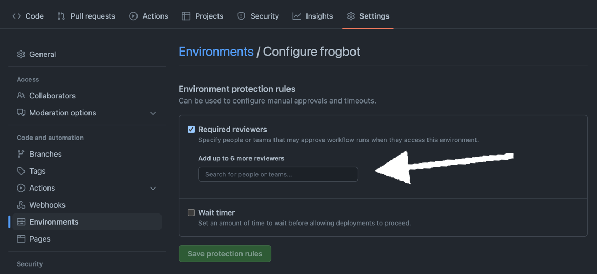

[Go back to the main documentation page](../README.md)

# Installing Frogbot on GitHub repositories

1. Frogbot uses a [frogbot-config.yml](templates/.frogbot/frogbot-config.yml) file to run. [This](frogbot-config.md) article will guide you through the process of creating this file. Throughout this documentation we will reference this Git repository which includes the [frogbot-config.yml](templates/.frogbot/frogbot-config.yml) file as the **Frogbot Management Repository**.

2. Install Frogbot using your platform of choice.

   <details>
      <summary>Install Frogbot Using GitHub Actions</summary>

   2.1. Make sure you have the connection details of your JFrog environment.

   2.2. Go to your **Frogbot Management Repository** settings page and save the JFrog connection details as repository secrets with the following names - **JF_URL**, **JF_USER**, and **JF_PASSWORD**

   > **_NOTE:_** You can also use **JF_XRAY_URL** and **JF_ARTIFACTORY_URL** instead of **JF_URL**, and **JF_ACCESS_TOKEN**
   > instead of **JF_USER** and **JF_PASSWORD**

   

   2.3. Check the Allow GitHub Actions to create and approve pull requests check box.

   

   2.4. Create a new [GitHub environment](https://docs.github.com/en/actions/deployment/targeting-different-environments/using-environments-for-deployment#creating-an-environment)
   called **frogbot** and add people or public teams as reviewers. The chosen reviewers can trigger Frogbot scans on pull requests.

   

   2.5. Use our [GitHub Actions templates](templates/github-actions/README.md#frogbot-gitHub-actions-templates) to add Frogbot workflows to your project.

   2.6. Push the workflow files to the **.github/workflows** directory in the root of your **Frogbot Management Repository**.
   </details>

   <details>
      <summary>Install Frogbot Using JFrog Pipelines</summary>

   2.1. Make sure you have the connection details of your JFrog environment.

   2.2. Save the JFrog connection details as a [JFrog Platform Access Token Integration](https://www.jfrog.com/confluence/display/JFROG/JFrog+Platform+Access+Token+Integration)
   named **jfrogPlatform**.

   2.3. Save your GitHub access token in a [GitHub Integration](https://www.jfrog.com/confluence/display/JFROG/GitHub+Enterprise+Integration) named
   **gitIntegration**.

   2.4.Create a **pipelines.yml** file using one of the available [templates](templates/jfrog-pipelines) and push the file to your Frogbot Management Git repository under a directory named `jfrog-pipelines`.

   2.5. In the **pipelines.yml**, make sure to set values for all the mandatory variables.

   2.6. In the **pipelines.yml**, if you're using a Windows agent, modify the code inside the onExecute sections as described in the template comments.

   **Important**
    - Make sure all the build tools used to build the project are installed on the build agent.

   </details>

    <details>
     <summary>Install Frogbot Using Jenkins</summary>

   2.1. Make sure you have the connection details of your JFrog environment.

   2.2. Save the JFrog connection details as Credentials in Jenkins with the following Credential IDs: **JF_URL**,
   **JF_USER** and **JF_PASSWORD** (You can also use **JF_XRAY_URL** and **JF_ARTIFACTORY_URL** instead of **JF_URL**
   and **JF_ACCESS_TOKEN** instead of **JF_USER** and **JF_PASSWORD**).

   2.3. Save your GitHub access token as a Credential in Jenkins with the `FROGBOT_GIT_TOKEN` Credential ID.

   2.4. Create a Jenkinsfile with the below template content under the root of your **Frogbot Management Repository**.
      <details>
             <summary>Template</summary>

   ```groovy
       // Run the job every 5 minutes 
       CRON_SETTINGS = '''*/5 * * * *'''
       pipeline {
           agent any
           triggers {
               cron(CRON_SETTINGS)
           }
           environment {
               // [Mandatory]
               // JFrog platform URL (This functionality requires version 3.29.0 or above of Xray)
               JF_URL = credentials("JF_URL")
       
               // [Mandatory if JF_ACCESS_TOKEN is not provided]
               // JFrog user and password with 'read' permissions for Xray
               JF_USER = credentials("JF_USER")
               JF_PASSWORD = credentials("JF_PASSWORD")
       
               // [Mandatory]
               // GitHub enterprise server access token with the following permissions:
               // Read and Write access to code, pull requests, security events, and workflows
               JF_GIT_TOKEN = credentials("FROGBOT_GIT_TOKEN")
               
               JF_GIT_PROVIDER = "github"
       
               // [Mandatory]
               // GitHub enterprise server organization namespace
               JF_GIT_OWNER = ""
       
               // [Mandatory]
               // API endpoint to GitHub enterprise server
               JF_GIT_API_ENDPOINT = ""
       
               // [Mandatory if JF_USER and JF_PASSWORD are not provided]
               // JFrog access token with 'read' permissions for Xray
               // JF_ACCESS_TOKEN= credentials("JF_ACCESS_TOKEN")
      
           }
           stages {
               stage('Download Frogbot') {
                   steps {
                       // For Linux / MacOS runner:
                       sh """ curl -fLg "https://releases.jfrog.io/artifactory/frogbot/v2/[RELEASE]/getFrogbot.sh" | sh"""
                       // For Windows runner:
                       // powershell """iwr https://releases.jfrog.io/artifactory/frogbot/v2/[RELEASE]/frogbot-windows-amd64/frogbot.exe -OutFile .\frogbot.exe"""
                   }
               }
               stage('Scan Pull Requests') {
                   steps {
                       sh "./frogbot scan-pull-requests"
                       // For Windows runner:
                       // powershell """.\frogbot.exe scan-pull-requests"""
                   }
               }
               stage('Scan and Fix Repos') {
                    steps {
                        sh "./frogbot scan-and-fix-repos"
                        // For Windows runner:
                        // powershell """.\frogbot.exe scan-and-fix-repos"""
                    }    
               }    
           }
       }
   ```
      </details>

   2.5. In the Jenkinsfile, set the values of all the mandatory variables.

   2.6. In the Jenkinsfile, modify the code inside the `Download Frogbot`, `Scan Pull Requests` and `Scan and Fix Repos` according to the Jenkins agent operating system.

   2.7. Create a job in Jenkins pointing to the Jenkinsfile in your **Frogbot Management Repository**.

   **Important**
   - Make sure that either **JF_USER** and **JF_PASSWORD** or **JF_ACCESS_TOKEN
   ** are set in the Jenkinsfile, but not both. - Make sure all the build tools used to build the project are installed on the Jenkins agent.**

   </details>

